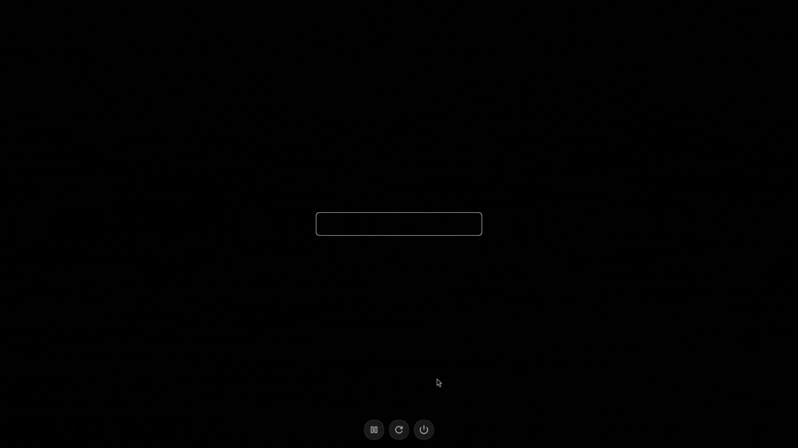

# Obscure SDDM Theme

A minimalist yet customizable SDDM theme that uses IPA (International Phonetic Alphabet) characters for password masking, creating an obscure and unique look for your login experience.



## Features

- Highly customizable appearance through `theme.conf`
- Unique IPA character-based password masking
- Support for custom background images

## Requirements

- SDDM >= 0.19.0
- Qt >= 6.0.0
- A system font that supports IPA characters (default: Inter)

## Installation

### Manual Installation

1. Clone this repository:

   ```bash
   git clone https://github.com/saatvik333/obscure-sddm-theme.git
   ```

2. Copy the theme to SDDM themes directory:

   ```bash
   sudo cp -r obscure-sddm-theme /usr/share/sddm/themes/obscure
   ```

3. Set the theme in SDDM configuration:

   ```bash
   sudo sh -c 'printf "[Theme]\nCurrent=obscure\n" > /etc/sddm.conf'
   ```

### Using Package Managers

Coming soon...

## Configuration

The theme can be customized through the `theme.conf` file. Here are the available options:

### General Appearance

- `textColor`: Color of the text (default: #ffffff)
- `errorColor`: Color for error messages (default: #ff4444)
- `backgroundColor`: Background color (default: #000000)

### Font Settings

- `fontFamily`: Font family to use (default: Inter)
- `baseFontSize`: Base font size in pixels (default: 14)

### Background Settings

- `backgroundImage`: Path to background image (default: none)
- `backgroundFillMode`: How to display background image (default: aspectCrop)
- `backgroundOpacity`: Background image opacity (default: 0.8)

### Login Behavior

- `allowEmptyPassword`: Allow empty passwords (default: false)
- `showUserSelector`: Show user selection menu (default: false)
- `showSessionSelector`: Show session type selector (default: false)
- `animationDuration`: Duration of animations in ms (default: 300)

## Shortcuts

The theme provides several keyboard shortcuts for quick access to various functions:

- `F1`: Toggle help text display
- `F2` or `Alt+U`: Toggle user selector
- `Ctrl+F2` or `Alt+Ctrl+U`: Switch to previous user
- `F3` or `Alt+S`: Toggle session selector
- `Ctrl+F3` or `Alt+Ctrl+S`: Switch to previous session
- `F10`: Suspend system (if available)
- `F11`: Shutdown system (if available)
- `F12`: Reboot system (if available)

## License

This project is licensed under the MIT License - see the [LICENSE](LICENSE) file for details.

## Acknowledgments

- Inspired by various SDDM themes in the community
- IPA characters sourced from standard Unicode specifications

## Support

If you like this theme, consider:

- Starring the repository
- Reporting bugs
- Contributing to the code
- Sharing it with others :)
